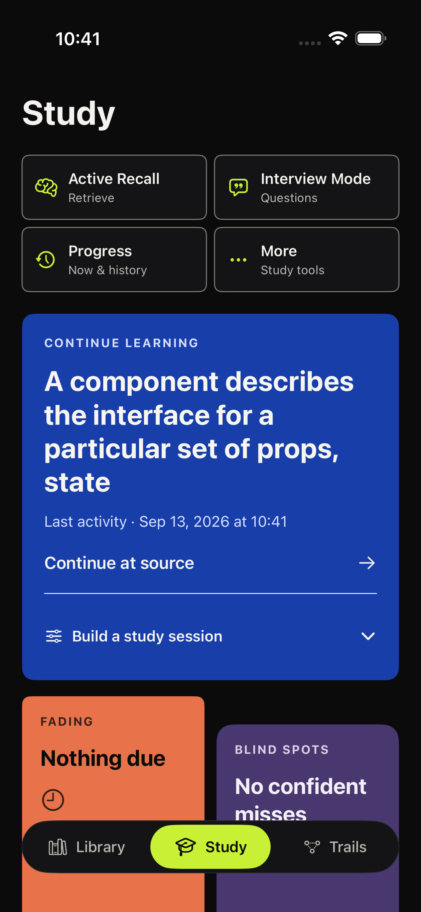
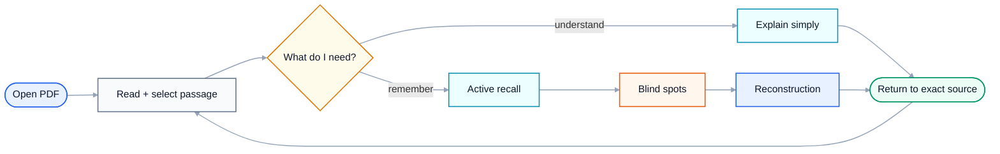
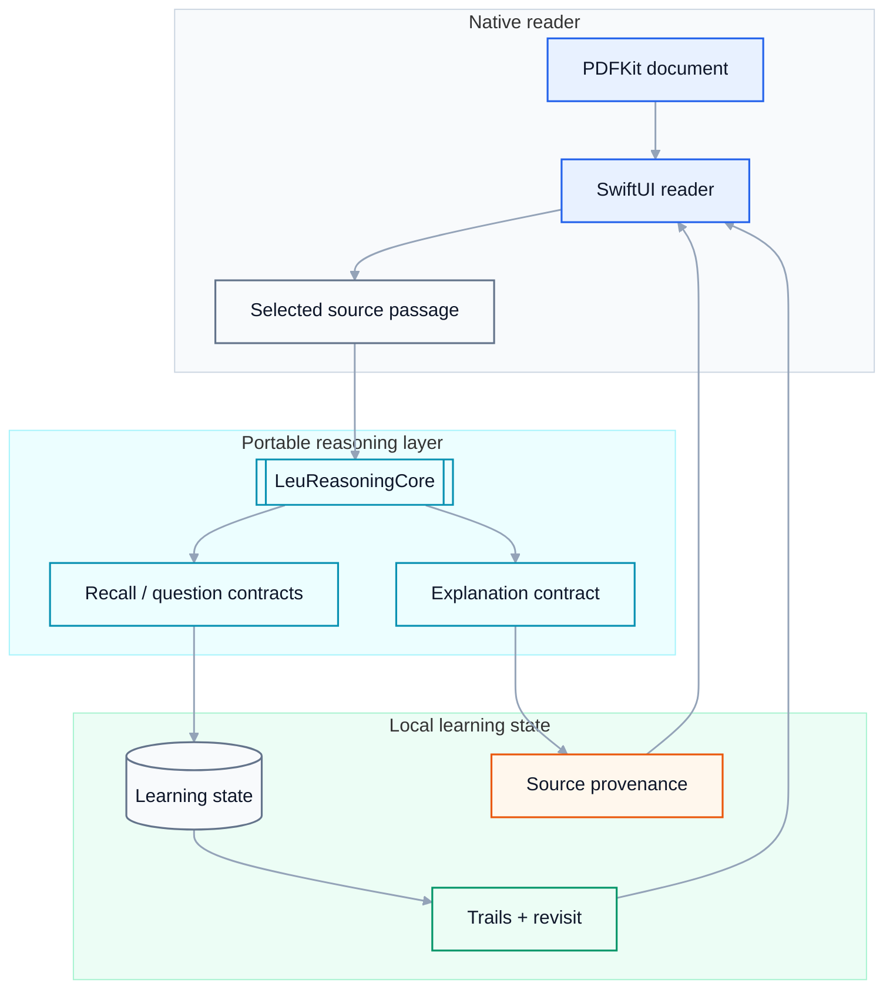

# Leu

**A native iPhone PDF study app that turns reading into active understanding — while staying local-first.**

<p align="center">
  
</p>

<p align="center"><sub>Native Study screen · retained capture</sub></p>

Leu is designed for a very specific moment: you are studying a difficult PDF on your phone, a paragraph stops making sense, and leaving the document to hunt for an explanation breaks your concentration.

The app keeps the learning loop inside the reader: **read → understand → recall → revisit**.

## The product flow



## Study is not a separate dashboard

Leu treats the document as the source of truth. Study tools are designed to route the user back to the material rather than replacing it with an AI chat feed.

## Core ideas

### Explain Like I’m 10

A selected passage can be rewritten into a genuinely simpler explanation instead of merely being shortened. The feature is designed around source provenance: the explanation belongs to a specific passage and should remain visibly connected to it.

### Active Recall

Leu turns reading into retrieval practice. The goal is not to accumulate cards; it is to surface what the reader can no longer reconstruct confidently.

### Blind Spots

Weak or fading concepts become navigable learning objects. A user can move from “I think I know this” to the exact source context that needs another pass.

### Reconstruction

Instead of only showing an answer, Leu creates space for the reader to rebuild the idea from memory and compare that understanding against the source.

## Native architecture



Leu is built in **Swift / SwiftUI** with **PDFKit** and a local-first product model. On-device intelligence is preferred where platform support allows it; cloud inference is not a mandatory dependency for the core reading experience.

## Design principles

- **The PDF remains primary.** Learning surfaces support the document instead of swallowing it.
- **Source provenance stays visible.** Model output should be traceable back to what the user was actually reading.
- **Local-first by default.** Reading history and learning state should not require a mandatory account or backend.
- **Phone-native interaction.** The product is designed around one-handed reading, sheets, touch targets, safe areas, Dynamic Type, and iOS conventions.
- **AI earns its place.** Model features must make a passage easier to understand or a concept easier to retain; “chat with PDF” is not the product.

## Repository shape

```text
Shelf/                         primary SwiftUI application
Packages/LeuReasoningCore/     portable reasoning + learning contracts
docs/                          design decisions, validation and captures
scripts/                       QA / native verification tooling
```

## Verification philosophy

Portable reasoning tests and native UI validation are deliberately separated. Passing pure logic tests does not certify SwiftUI layout, gestures, haptics, PDF interaction, or listening quality.

The repository includes native journey evidence and deterministic reasoning fixtures, while explicitly retaining native-device validation as its own gate.

## Current state

Leu is actively evolving. The repository contains production-style native surfaces and deep QA infrastructure, but individual experimental learning/model paths may still have open native verification work. The README intentionally avoids presenting experimental gates as shipping certification.

---

Built by [Miguel Almeida](https://github.com/miguelalmeida0).

<details>
<summary>Other retained native captures</summary>

[Simulator capture](./docs/readme/current/00-current-simulator-home.png)

[Study: fading section](./docs/readme/current/03-fading.png)

[Study: blind-spots section](./docs/readme/current/04-blind-spots.png)

[Study: reconstruction section](./docs/readme/current/05-reconstruction-labs.png)

These are retained capture files, not a new device-validation run.

</details>


[Repository guide](./docs/START_HERE.md)

<!-- repository-presentation-repair:1 -->
