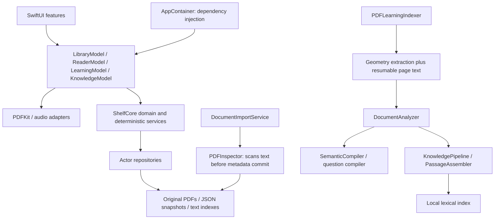

# Leu semantic learning engine: current architecture and implementation plan

Date: 2026-09-12. Status: pre-implementation architecture audit. The requested semantic engine is **not implemented** by this document. Production source is unchanged in this audit. The V25 reconstruction remains an uncompiled baseline, not a verified release.

The user's attached brief is the task specification. Existing reports describe previous work and are evidence to check, not instructions to override this brief. Repository-wide file/dependency inventory is in [SOURCE_AUDIT.json](SOURCE_AUDIT.json); the inspection concentrated on every major application boundary and the paths below. Inventory coverage is not a claim of line-by-line correctness or runtime verification.

## 1. Execution prerequisites

- Repository root: `/Users/malmeida/Documents/ChatGPT/Leu`; application: `LeuNativeV24_5/`.
- Current Git state: unborn `master`, zero tracked files, no commits. There is no existing commit convention to infer. The previous ZIP is the recoverable byte baseline.
- The brief requires a dedicated branch before implementation. Planned branch: `feature/leu-semantic-learning-engine`. This session's filesystem policy marks the repository `.git` read-only, so the branch cannot be created here. No branch, baseline commit or implementation commit is claimed. No alternate Git directory will be used to bypass that restriction.
- Fresh `swift --version` returns `error: permissionDenied`. Xcode reports 26.6 / 17F113. Build and all independent test suites are attempted for an audit baseline; see [VERIFICATION.md](VERIFICATION.md). Source checks cannot establish an executable milestone.
- Audit documentation can be completed now. Production changes must wait for the branch prerequisite, and phase acceptance requires functioning Swift/Xcode plus simulator/device evidence. The task is not complete when this document is written.

## 2. Current system and reusable components

The app targets iOS 17.0 and uses Swift language setting 5.0. ShelfCore uses Swift tools 5.9 and supports iOS 17 / macOS 13. The app has 156 Swift files, the portable core 101, core tests 38 files, integration tests 6 files and UI tests 12 files. Including Package.swift there are 314 Swift files. These are file counts, not passed tests.

Paths below are relative to the application root.

| Area | Current implementation | Reuse / necessary change |
| --- | --- | --- |
| Composition / SwiftUI | `Shelf/App/AppContainer.swift` is the composition root; RootView hosts library, reader and study. Feature models use Observation and MainActor. | Inject new adapters here. Keep current navigation and feature ownership. |
| Import | `LibraryModel+Import` → IncomingFileService → DocumentImportService → FileDocumentVault / PDFInspector → LibraryRepository. Security-scoped input is staged, copied, validated and SHA-256 fingerprinted; duplicates are reconciled. | Preserve ownership, byte checks and duplicate handling. Split minimal PDF validation from full text indexing so the book becomes readable before semantic processing. |
| Native text | PDFInspector reads `PDFPage.string` during import, up to 5,000 pages / index byte cap. A second path, `PDFKitTextExtractor`, reconstructs glyph geometry for study. | One typed extraction result consumed by both indexes; preserve immediate lightweight validation. Do not maintain a third independent extraction implementation. |
| PDFKit / Original reader | PDFDocumentLoader owns loading; a transferred PDFDocument reaches ReaderModel/PDFSessionController. PDFView drives Original mode; actors have separate documents for inspection, search and thumbnails. | Keep PDFKit objects within their owning executor. New engine returns Sendable value records, not PDFPage/PDFDocument handles. |
| Read Mode | PDFSpatialTextExtractor → PDFLineGrouper → PDFBlockClassifier → PDFTextReconstructor → ReadablePage. ReaderModel caches/renders page projections. | Retain geometry algorithms; expose stable blocks and raw anchors before converting to display-only ReadableBlock. Avoid heavy glyph extraction on MainActor. |
| OCR | No Vision OCR provider or persistent OCR result exists. Low-text documents show a notice and remain readable. | Add selective Vision OCR behind an extraction protocol; never OCR healthy native pages. |
| Structure | DocumentAnalyzer normalizes pages, detects repeated edge lines and assigns six SourceSegment kinds. PDFDocumentLoader has embedded/inferred TOC plus explicit navigation landmarks. | Retain embedded outline hierarchy. Extend block kinds and source maps; do not call landmarks chapters. |
| Extraction resume | PDFTextExtractionCheckpointStore saves accumulated pages every 16 pages, keyed by document fingerprint/extraction version; removed after final analysis commit. | Replace cumulative checkpoint rewriting with page commits and durable stage state. Preserve completed extraction as reusable cache, including OCR. |
| Persistence | Actor repositories: LibraryRepository, LearningRepository, KnowledgeRepository. JSON stores have current/previous snapshots and corruption recovery. Originals are ordinary files; text indexes are per-book JSON. | Preserve user data stores and decoding. Add per-document derived semantic storage through a protocol; keep embeddings outside monolithic snapshots. |
| Search | LibraryTextSearch and PDFPageSearch provide lexical text search. KnowledgeSearchEngine uses BM25, phrases and aliases; ConnectionRanker adds concept/heading/proximity evidence. | Retain these as lexical baseline; add local embeddings and hybrid ranking through a shared retriever. Existing search surfaces consume results. |
| Concepts | SemanticCompiler extracts general claims and uses optional curated aliases. KnowledgeConcept/ConceptCatalog are a separate identity system; PassageConceptBinding connects knowledge passages. | Reconcile identities with an explicit bridge. Do not introduce an unrelated third concept catalog. |
| Graph | KnowledgeConnection links passages with typed user/suggested connections. SemanticIndex stores propositions and tentative co-occurrence associations. | Preserve user edges; distinguish evidence-backed concept edges from similarity suggestions. Similarity alone never establishes prerequisites/causation. |
| Questions | QuestionRealizer, language/teaching gates, SemanticQuestionCompiler and importance ranking produce source-bound multiple choice. LearningQuestion has one LearningSource and optional proposition/operator metadata. | Adapt existing generation into candidate → critic → grounding → acceptance. Add block/concept provenance and rejection records; no direct model-to-UI path. |
| Lens | Source context, plain meaning, key idea, disclosed related facts/questions; SourceMeaningComposer bounds composition to selected source. | Use the same canonical blocks/claims and source router as search/questions. Preserve hierarchy, identifiers and return context. |
| Trails / study | Ordered Trail stops, persisted position, Continue/Next; StudySession/StudyActivity, recall, interviews, labs, masks and recordings. | Extend structured activities after the vertical slice passes; do not replace working Trails or create a parallel study screen. |
| Mastery | ReviewState is per learning object. ReviewScheduler uses rating, hints, difficulty, stability and spacing. Attempts capture confidence/latency; importance ranking includes wrong/confident-wrong responses. | Preserve event history. Later derive concept mastery with transparent scoring rather than reinterpret old unknown values as observed facts. |
| Voice | SpeechCompiler/ParagraphBuilder → AppleSpeechEngine or optional Supertonic. Source/sentence ranges, remote commands and audio session handling already exist. | Reuse normalized blocks/source maps. Do not couple semantic generation to voice or change perceptual parameters in this project phase. |
| Tests | ShelfCore XCTest; native PDFKit integration; XCUITest; Python static contracts and orchestration tests. Runner inventories every baseline test and attempts independent suites. | Retain assertions and inventory protection; add tests next to affected layers rather than empty parallel test infrastructure. |

The current `ReaderModel` is 298 lines and ReaderSpeechController 282; these are existing review warnings, not targets for unrelated refactoring. New semantic behavior must not grow these into orchestration managers.

## 3. Existing dependencies and flow

## 4. Debt that directly blocks the requested engine

| Priority | Evidence and consequence | Required repair and acceptance |
| --- | --- | --- |
| P0 | DocumentImportService awaits PDFInspector's text scan before repository insertion. | Import validates/copies/fingerprints/commits first; deferred indexing cannot block opening. Measure time-to-readable separately from indexing. |
| P0 | PDFKitTextExtractor turns classified geometry into joined strings; SourceSegment lacks raw ranges/bounds; AnalyzedPage stores only normalized text. | Preserve raw page text, normalization map, stable occurrence IDs and region anchors through every stage. Native and OCR coordinates must share one documented page space. |
| P0 | DocumentAnalyzer strips any terminal hyphen before a lowercase continuation, collapses whitespace and removes matching repeated-edge strings anywhere on a page. | Reuse conservative spatial repair, preserve code indentation and remove repeated headers only in actual edge regions. Add body-text counterexamples. |
| P0 | Segment IDs hash document/page/text without an occurrence index. SemanticEvidenceSpan starts at segment-local offset; its default length uses character count while PDF selection uses UTF-16. | Stable block occurrence identity; typed UTF-16/raw/normalized ranges; tested Unicode and duplicate passages. Never treat segment-local offsets as PDF offsets. |
| P0 | No OCR, extraction-confidence gate, vectors, embedding cache or retrieval evaluation. | Add selective local OCR and versioned local retrieval before expanding study modes. Absence of a model must not break reading. |
| P0 | `check-learning-offline.py` explicitly bans Vision/model inference for the old deterministic release; existing privacy scans do not cover proposed SemanticEngine directories. | The new brief explicitly authorizes local Apple inference. Update the release contract narrowly, allow Apple adapters and extend no-egress checks to all new paths, with negative tests. Moving code outside scanner roots to obtain a green check is not acceptable. |
| P0 | Learning semantic concepts and KnowledgeConcept use different identities; question source has no block IDs. | Explicit identity/evidence bridge, multi-source anchors, non-destructive migration. Unresolved legacy anchors remain unavailable for new generated answers. |
| P0 | `KnowledgeModel.passage(for:)` can choose maximum token overlap without a minimum threshold. | Approximate candidates are not exact provenance. Source navigation requires a confirmed anchor; ambiguity opens the declared page with an honest unresolved-passage state. |
| P1 | PDFLearningIndexer accepts QuestionGenerating but calls concrete semantic compilers; KnowledgeModel constructs concrete search/pipeline services. | Make existing replaceable contracts real injection points. Remove unused injection only as part of the adapter change, with behavior tests. |
| P1 | Knowledge versioning does not include every upstream extraction/analysis/semantic version. | Invalidation includes content digest and the full stage version chain; changing a model must not reuse incompatible vectors or silently relabel old provenance. |
| P1 | Search rebuilds BM25 and maps synchronously from KnowledgeModel's MainActor path. Full snapshots hold duplicated text. | Search actor, cached immutable lexical state, bounded candidate results and paged vector storage. Benchmark before adopting ANN. |
| P1 | Cumulative checkpoint writes swallow persistence failures; final analysis replaces whole documents; detached knowledge work lacks propagated cancellation. | Throw/report durable-write failure, page/stage commits, generation tokens checked before commit, resumable work units. Cancellation is not corruption. |
| P1 | No thermal/low-power processing policy; reader geometry work can run on MainActor. | One serial page worker, short cooperative stages, policy-controlled suspension and immutable UI projections. Measure rather than promise zero frame drops. |
| P1 | Current question gates do not prove distractor uniqueness; regex labels include structural code assumptions. | Source presence is necessary but not sufficient. Record answer derivation and reject unsupported/ambiguous alternatives; do not certify a rule's external knowledge merely because its code token appears. |
| P1 | Planner ties use newly created activity UUIDs; same inputs can produce different order. | Inject clock/IDs and use stable candidate keys before claiming deterministic adaptive behavior. |
| P1 | BackupWriter packages LibrarySnapshot and PDFs, not the separate learning/knowledge history. | Design an explicit compatible backup extension before shipping new irreplaceable mastery/authoring data. Derived embeddings may be rebuilt; attempts/user edits may not. |

## 5. Target boundary: extend, do not duplicate

Use `Packages/ShelfCore/Sources/ShelfCore/SemanticEngine/` for portable contracts, new value types and orchestration policies. Apple implementations belong under `Shelf/SemanticEngine/Providers/`. Existing learning/knowledge services remain adapters during migration; do not move all old files merely to make the tree match the brief.

Create folders only with a concrete implementation: Ingestion, Extraction, Normalization, Embeddings, Retrieval, Concepts, KnowledgeGraph, Generation, Grounding, StudyFlows, Mastery, Persistence, Providers and Diagnostics. Tests live in the existing ShelfCoreTests/ShelfTests/ShelfUITests targets, with corresponding SemanticEngine groups. No empty façade classes or second app-level state owner.

| Boundary | Contract responsibility | First implementation / reuse |
| --- | --- | --- |
| DocumentTextExtractor | Yield one page result with quality, raw anchors, strategy and recoverable failure | Adapt PDFKitTextExtractor and existing geometry pipeline |
| OCRProvider | Recognize a bounded rendered page; return text regions/confidence; cancellation | Vision adapter; no remote implementation |
| EmbeddingProvider | Expose capabilities/model descriptor and async text vector | NaturalLanguage sentence embeddings when available |
| SemanticRetriever | Query + filters → ranked block/chunk anchors with diagnostics | Existing BM25 plus local cosine store |
| ConceptExtractor | Bounded section context → evidence-backed concept candidates | GeneralClaimExtractor/SemanticCompiler adapter; optional structured Apple model later |
| StudyContentGenerator | Retrieved evidence + intent → unaccepted candidates | Existing deterministic question engine; optional Foundation Models adapter |
| GroundingValidator | Validate IDs, versions, spans and supported answer derivation | Deterministic evidence checks; no network |
| MasteryEngine | Attempt event + prior state + time → transparent local state | Adapt ReviewScheduler only in phase 6 |
| SemanticPersistence | Transactional page/stage commits and versioned retrieval | Per-document local derived store; preserve existing user repositories |
| ProcessingPolicy | Device/scene state → start/yield/pause budget | Apple capability/power adapter plus portable decisions |

Every expensive operation is async, cancellable and injected. Apple types stay out of ShelfCore. No manager owns import, search, generation, mastery and UI together.

## 6. Phase 1: reliable structured ingestion

Native quality is a set of explainable signals, not a single text-length threshold: empty/tiny text, replacement/control character rate, abnormal repeated glyph runs, implausible spacing, encoding anomalies and native text coverage relative to visible regions. Short title/diagram pages are not automatically bad. A cheap bounded raster coverage check is allowed for suspicious pages; full OCR is not performed on healthy native pages. Thresholds are calibrated on held-out fixtures and recorded by version, not presented as calibrated probabilities.

`PageExtractionStrategy` records nativePDF, visionOCR or advancedFallback. advancedFallback initially means an explicit unavailable provider/failure state; it never calls a remote endpoint. Each page retains page index, crop/media box, rotation, raw text, normalized text, native UTF-16 ranges where valid, region IDs/bounds, provider revision, language, confidence and quality reasons.

Vision runs page-by-page off MainActor on an independently owned renderer. Raster dimensions/megapixels have an explicit memory budget. Cancellation cancels the current Vision request and checks before commit. Preserve recognized region confidence and transform Vision coordinates into PDF crop-box coordinates, including rotation. Language support comes from the installed request capabilities, not an assumed universal language list. [Apple Vision text recognition](https://developer.apple.com/documentation/vision/vnrecognizetextrequest).

SemanticBlock uses document ID + document digest + page + occurrence anchor, with content hashes as revision metadata. It includes block type, raw/normalized text, heading path, source anchors, extraction confidence and normalization version. Types cover title, heading, paragraph, list, definition, example, quote, code, table, figureCaption, formula, callout and unknown. Uncertain layouts remain unknown; table cell relations and diagram meaning are not invented.

Retain both raw and normalized representations when transformations occur. Normalization records edits/maps. Preserve real hyphens, lists, sentence boundaries and code indentation. Repeated header/footer suppression is position-aware and reversible. OCR text gets region anchors, never fake native character indices. Reader overlays display OCR regions without modifying original PDF bytes.

Persist each successful page before advancing its checkpoint. A failed page records error/retry state while other completed pages remain valid. Reopening does not rerun OCR when content/provider/pipeline versions match. After process termination at page 220, resume from the last committed unit, not page 1. A storage error is visible and retryable, not silently reported as Ready.

## 7. Chunking, embedding persistence and semantic retrieval

Chunks follow embedded/inferred hierarchy and block boundaries; each has block IDs, headingPath, page range, parent/previous/next IDs and content digest. Keep definitions/examples intact where possible. Oversized blocks split on sentence or code-line boundaries, retain subranges and an explicit continuation relation. Provider input limits control chunk size; do not pretend character counts are token counts. A small adjacent-block overlap is allowed only where continuity needs it and is excluded from duplicate counting.

Use NaturalLanguage sentence embeddings where the language/revision is installed and supported. A nil embedding is an explicit limited capability, not a zero vector and not permission to label lexical results semantic. Record provider, supported revision, language, dimensions, input digest, chunk version, creation time and relevant OS build. Do not claim a private model weight identifier Apple does not expose. Query and document vectors must match descriptors. Reject zero/nonfinite/wrong-dimension vectors. [Apple NLEmbedding](https://developer.apple.com/documentation/naturallanguage/nlembedding).

Initially retain existing JSON repositories for user state. Store derived page/block/chunk records per document and vectors in compact versioned shards behind SemanticPersistence. Write new immutable artifacts, validate hashes, then atomically replace the active manifest; maintain last-known-good generation. Partial output never becomes a Ready index. Do not append Float arrays to learning.json or knowledge.json. Controlled reindex can build a new generation alongside the active compatible one, with disk budget checks. Delete stale artifacts after successful commit; deleting a book invalidates its derived data.

Exact cosine scan is the first vector implementation, with bounded memory and per-query top-K heap. Apply document/chapter/page/type/concept filters before scoring. Combine lexical BM25, semantic similarity, heading evidence and optional current-document/page proximity; normalize score families or use rank fusion so raw BM25 does not dominate cosine. Sort ties by stable IDs. Concept similarity is not graph truth. Cache query vectors briefly without persistent plaintext query logging by default.

Expose rank components, matched fields, provider descriptor and source block IDs only in DEBUG Semantic Inspector. Existing library/knowledge/reader search surfaces get cancellable results with the same source action. Include available/unavailable/partial states without dumping ML scores into consumer UI.

Retrieval acceptance uses dozens of independently labeled paraphrase queries, including old callback state → lexical/stale closures. Report Recall@1/@3/@5 and MRR for exact text, current BM25 and hybrid retrieval, per document class and language. Keep tuning and held-out queries separate; do not pass a semantic benchmark through query-specific keyword rewrites. Phase 2 passes only with measured gains over the lexical baseline and acceptable device resource use.

## 8. Concepts, graph and grounded study

Keep KnowledgeConcept IDs for user-created concepts and aliases. Build an identity bridge from existing semantic IDs and section-local extracted candidates. Names/aliases alone do not establish equivalence across different senses. Exact aliases plus compatible source definitions can merge automatically; similarity proposes merges with docs/internal/evidence/confidence and reversible provenance. Preserve old IDs through aliases/tombstones so Trails and attempts survive reindexing. Cross-document concepts reference many source blocks rather than encoding a PDF ID in global identity.

Typed concept edges add prerequisite, related, contrastsWith, exampleOf, causes, consequenceOf, commonlyConfusedWith and buildsOn only with supporting block IDs, direction, confidence and derivation. Explicit user edges remain user assertions; co-occurrence stays a suggestion. Do not turn the illustrative closures → effects chain into a hardcoded ontology.

Extend accepted questions with conceptIDs, sourceBlockIDs, sourcePages, source versions, answer/rubric, difficulty, type, confidence and generationVersion. Retain compatibility fields for existing UI until adapters migrate it. The only acceptance path is retrieval → candidate generation → critic → grounding → semantic deduplication → difficulty calibration → persisted accepted object. Persist rejection reasons and stage versions. Presence of a quoted sentence alone does not prove a newly inferred answer or unique distractor correctness.

Reuse the current realizer and gates first. A bounded structured Foundation Models adapter may later generate candidates and critique them; it cannot certify its own answer as grounded. Verify quoted support against canonical blocks and constrain transformations to evidence-supported rules. Reject missing/deleted/stale/foreign block references, fabricated quotes, answer leakage, ambiguity and semantically duplicate questions. Uncertain inference is omitted from scored questions. No generated text reaches the learner before acceptance.

Question families: recall and explain from definitions; mechanism from explicit causal/process claims; prediction/debugging from a supported scenario/outcome or constrained code semantics; compare from supported distinctions; misconception from an explicitly evidenced misconception/correction; transfer from a validated transformation of the principle; connection from an evidenced cross-section relationship. Lack of evidence means no question of that type, not invented variety. Open answers use expected ideas/rubrics and preserve self-assessment; unvalidated keyword overlap is not an authoritative examiner.

Provenance UI reuses ReaderRoute/KnowledgeDestination and current Back to question/Trail/Lens behavior. Sources can contain multiple documents/pages. Each tap selects an exact native span or OCR region; the first page of a multi-source answer is not presented as its only support. Imported document text is untrusted model input and cannot change tools, privacy policy or evidence-validation rules.

## 9. Capability, privacy and processing policy

Keep iOS 17 as the baseline. Compile/availability-gate Apple adapters; detect language embeddings and Foundation Models independently. Foundation Models availability depends on supported devices/settings/region/model readiness, so it is checked at runtime, not inferred from OS version alone. Use structured bounded generation only after availability succeeds. [Apple SystemLanguageModel](https://developer.apple.com/documentation/foundationmodels/systemlanguagemodel) and [structured generation](https://developer.apple.com/tutorials/develop-in-swift/generate-structured-content).

Internal capability modes: FullSemantic (local retrieval plus available generation), LocalSemanticLimited (local retrieval/deterministic generation), ExtractionOnly (PDF/OCR/structure/lexical retrieval/deterministic study), OptionalCloudEnhanced (reserved, disabled/unimplemented). These are capabilities, not consumer feature tiers. Unsupported Apple Intelligence devices retain reading, OCR when language is supported, search and deterministic study.

Ordinary processing has no metered inference service: target €0 per PDF. Device compute, storage and optional model-asset downloads still consume local resources/data; €0 is not a battery/performance claim. Existing Supertonic asset downloading is opt-in and separate from PDF inference. No PDF content upload, paid provider, backend, hosted vector database or cloud fallback is introduced. Future paid-provider evaluation must document price/free-tier/rate/retention/privacy/overrun/spend-cap/failure behavior before integration; phase 7 remains deferred.

A serial processing actor owns work order; limited concurrency is introduced only after profiling. Interactive pauses bulk work for opening/search; balanced performs bounded page work while active; background checkpoints and yields to system suspension. Low Power Mode, battery and thermal state constrain new work; serious/critical thermal state pauses expensive OCR/generation. Recheck job generation/content digest and cancellation before every commit. Background survival is best-effort with durable resume, not a promise of unrestricted iOS background execution.

Account for low storage before large render/index writes. Keep file-protection behavior compatible with background/resume needs. Existing AppPaths sets completeUntilFirstUserAuthentication at its root; verify actual child-file protection and backup behavior rather than assuming propagation. Developer diagnostics are local, DEBUG-only, bounded and opt-in for raw excerpts. Ordinary logs contain counts/errors/version IDs, not PDF passages.

## 10. Later study flows and mastery: gated behind the vertical slice

Adapt current StudySession/StudyActivity into a versioned StudyFlow projection, preserving user checkpoints/history. First Pass must combine reading, key idea and supported challenges; Interview Pressure uses response/timer/follow-up; Weak Spots selects uncertainty; Connections uses supported edges; Teach It compares expected ideas; Boss Round mixes related difficult concepts. They must differ in behavior and evidence, not merely labels on the same quiz.

ConceptMastery is a derived state over durable attempt events. Reuse rating/hint/time/confidence signals; add observed difficulty, retry grouping, repeated misconception and spacing. Distinguish missing values from zero, assisted success from independent success and self-reported recall from scored correctness. Response speed is a secondary signal, not a punishment for accessibility needs. Inject clock and use stable IDs so histories replay reproducibly.

Start with a documented deterministic update, bounded confidence/stability and time-based forgetting. Priority follows importance × knowledge gap × forgetting risk × prerequisite impact, with explicit floors for new concepts and bounded graph influence so unknown concepts are not permanently starved. Verify two distinct mistake histories produce different sessions while strong concepts recur at appropriate intervals. No claim of calibrated mastery until learning outcomes are evaluated.

## 11. Migrations and failure semantics

Version every stage independently: document digest, extraction/OCR provider, normalization, block schema, chunking, embedding descriptor, concepts, graph, generation/critic/grounding and ranking. A changed embedding model invalidates vectors and dependent retrieval artifacts, not originals or attempts. Reanalysis preserves user-authored concepts/edges/Trails and maps source revisions; unresolvable anchors become explicit recovery items.

Never turn a failed/future-schema decode into an empty user history. Add migration fixtures for existing JSON, absent new optional fields, corrupt generation manifests, interrupted writes and unknown future versions. Newly derived caches can be deleted/rebuilt; attempts, notes, recordings and user graph edits cannot. Library backups need an explicit versioned extension for irreplaceable learning data before adaptive history ships.

| Failure | User/result state | Resume rule |
| --- | --- | --- |
| Corrupt/encrypted PDF | Existing explicit import error; password unlocking remains outside current supported flow | Retry valid/unlocked file |
| Blank page/document | Readable PDF; no fabricated concepts | Store completed blank result |
| Bad native text / OCR failure | Page quality recorded; readable Original; study may be partial | Retry failed page only |
| Unsupported language / embeddings absent | Native/OCR where supported and lexical results; no fake semantic vector | Reindex embeddings when supported |
| Generation unavailable/timeout | Deterministic accepted objects or none; no infinite spinner | Bounded retry on capability change/user action |
| App termination | Last committed page/stage remains active | Resume by version/digest/generation |
| Low storage | Visible paused/error state; retain last valid index and originals | Resume after space exists |
| Thermal/background suspension | Quiet checkpointed pause; reading remains usable | Policy-triggered resume |
| Stale/ambiguous anchor | Declared source page plus honest unavailable span | Reanchor only with verified evidence |

## 12. Corpus, diagnostics and measured gates

Retain six bundled synthetic PDFs and current regression tests. Add owned synthetic fixtures for normal text, raster-only scans, programming prose, code, tables, two columns, diagrams, corrupted text layers, long documents and mixed native/OCR. Include Unicode, duplicate passages, near-identical distractors, footer-like body content, legitimate hyphens and code indentation. Do not include copyrighted commercial books or transmit user PDFs for evaluation.

Build a 200-page mixed fixture with exactly 188 healthy native pages and 12 raster-only/problematic pages as a routing acceptance test. Those numbers are an expected fixture distribution, not an observed result. Hold out documents/layouts and paraphrases to prevent tuning to bundled wording. Real user-provided technical PDFs require local evaluation with their permission; synthetic tests alone do not establish universal usefulness.

DEBUG Semantic Inspector reuses the composition root and local diagnostics records: page strategies, quality reasons, region/block/chunk counts, embedding descriptor/count, concepts/edges, generated/rejected objects, durations, disk use; query rank components; candidate support, critic/grounding/rejection/difficulty/version. It has no production navigation entry and no network telemetry.

Benchmark 20/100/300/800-page documents, and libraries of 10/100/1,000 documents with declared page counts and content mix. Measure cold/warm time-to-readable, native extraction, OCR, normalization, embeddings, generation, query p50/p95, peak resident memory and disk footprint on named devices/OS/thermal state. Include cancellation latency and restart cache-hit rates. Report failed/partial cases; do not replace Apple benchmarks with a Python imitation. No latency, storage or retrieval-quality measurement is available for the new engine because it does not exist yet.

## 13. Implementation order and acceptance

| Phase | Concrete change | Gate before proceeding |
| --- | --- | --- |
| 0 | Audit, document, writable dedicated branch, immutable baseline commit excluding ZIPs/caches | Existing code builds/tests or failures are attributed; source baseline recoverable |
| 1 | Import decoupling; typed extraction; selective Vision; stable blocks/anchors; durable page checkpoints; consumer adapters | Structured native/mixed/scanned PDFs, reopen cache hits, exact source overlays, interrupted indexing resumes |
| 2 | Hierarchical chunks; embeddings/provider descriptor; local vector shards; hybrid search; DEBUG Inspector | Held-out retrieval beats current lexical baseline with measured device resource budget |
| 3 | Identity bridge; section extraction; conservative aliases; explicit evidence graph | Navigable concepts/edges without broken existing Trails/user edits |
| 4 | Candidate/critic/grounding/deduplication; multi-source navigation; grounded question variety | End-to-end import → search → accepted question → exact source works on real PDFs; all accepted objects anchored |
| 5 | Six distinct structured flow behaviors in current study surfaces | User-visible pedagogical difference and interruption-safe persistence |
| 6 | Concept mastery and deterministic next-session ranking | Different histories yield different useful sessions; no confidence-only mastery claims |
| 7 | Evaluate hard-document escalation only from recorded Vision failures | Measured corpus benefit plus explicit privacy/cost approval; no provider added by this plan |

Logical commits after the baseline: extraction/anchors; persistence/resume; OCR/quality; chunks/vectors; retrieval/diagnostics; graph bridge; generation/grounding; integration/benchmarks. Each includes its tests and migration notes. Do not push, deploy or modify production configuration. Do not start adaptive flows while the first four phases lack an executable, useful vertical slice.

## 14. Current honest quality summary

- **Available in source:** PDF reader/import, local lexical search, deterministic claims/questions, Lens, Trails, review history and voice. The inherited V25 source is not compiled in this environment.
- **Heuristic today:** PDF order/normalization/headings, general claim extraction, question quality/distractors, alias packs, BM25 connections and learning priorities.
- **Not implemented:** OCR fallback, persistent local embeddings/vector retrieval, the new unified model, capability-aware structured model generation, semantic Inspector, retrieval/ingestion benchmarks and concept-adaptive flows.
- **Apple Intelligence requirement:** none for the current baseline; proposed model-based enrichment only. Reading/OCR/local lexical/deterministic behavior must remain independent.
- **Known weak PDFs:** scanned/empty text layers, complex tables/diagrams/mathematics, unusual encodings and complex column order. Exact failing corpus rates are not measured.
- **Money:** no paid inference introduced; local baseline remains €0 in metered service fees. No new remote escalation or provider integration.
- **Completion:** audit/architecture only. Required branch and executable toolchain access are the immediate blockers to implementation and demonstrable acceptance.
